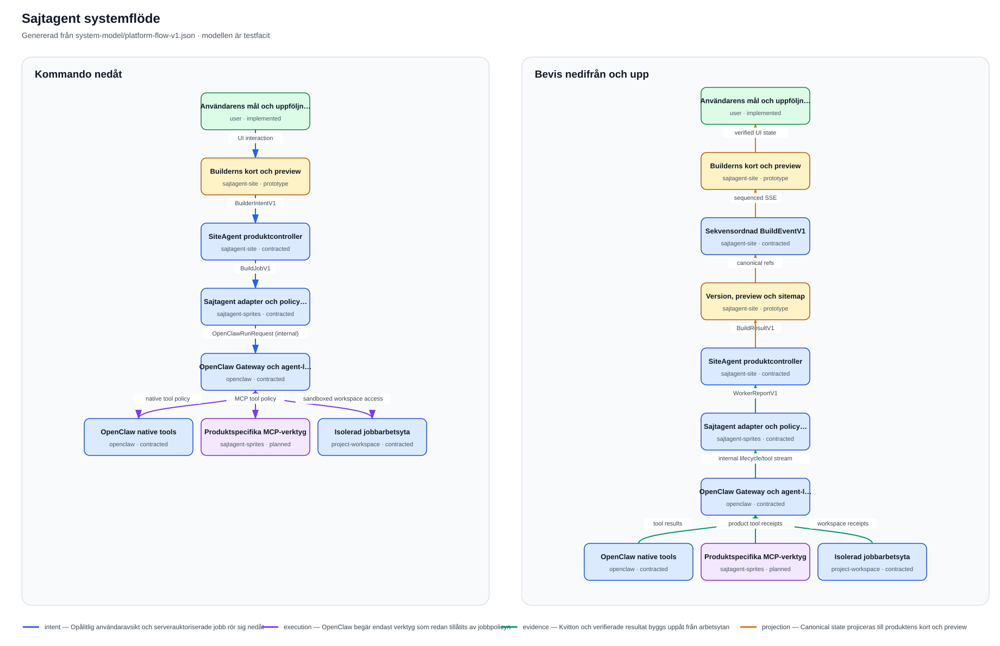
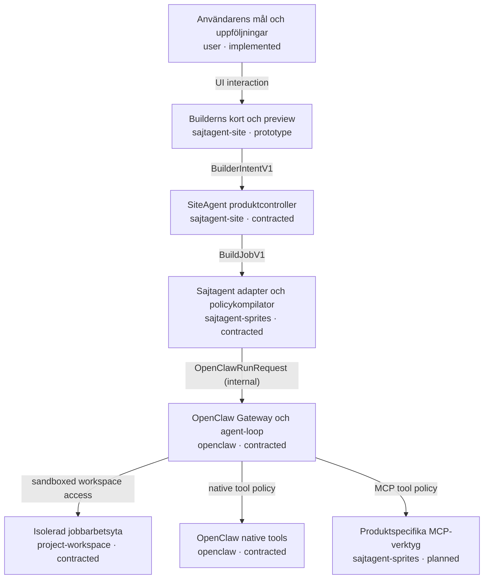
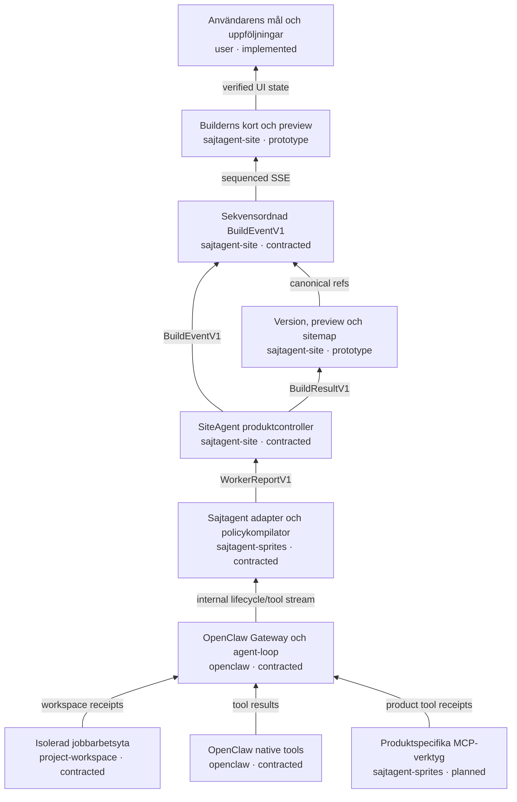

# Sajtagent systemflöde

<!-- Generated by scripts/render-system-flow.py from system-model/platform-flow-v1.json. -->

Den maskinläsbara modellen är auktoritativ. Diagrammen visar samma flöde i två riktningar: kommandon nedåt och verifierbara bevis nedifrån och upp.

## Kommando nedåt

## Bevis nedifrån och upp

## Felkarta

Välj en felande nod i kontrollpanelens vy **Systemflöde** för att se alla påverkade steg och vilket repo som äger diagnosen.

| Kod | Nod | Upptäcks av | Synligt symptom |
| --- | --- | --- | --- |
| `workspace.unavailable` | Isolerad jobbarbetsyta | `sajtagent-sprites` | Jobbet stoppas innan filverktyg får användas. |
| `tool.denied-or-failed` | OpenClaw native tools | `openclaw` | Verktyget nekas eller ger ett kvitto med felstatus. |
| `mcp.unavailable` | Produktspecifika MCP-verktyg | `sajtagent-sprites` | Ett produktspecifikt verktyg saknas eller fallerar stängt. |
| `openclaw.run-failed` | OpenClaw Gateway och agent-loop | `sajtagent-sprites` | Run avslutas med error, timeout eller avbrott. |
| `adapter.policy-rejected` | Sajtagent adapter och policykompilator | `sajtagent-sprites` | Jobbet kan inte bindas till en striktare runtimepolicy. |
| `controller.verification-failed` | SiteAgent produktcontroller | `sajtagent-site` | WorkerReport accepteras inte och ingen canonical version skapas. |
| `projection.persistence-failed` | Version, preview och sitemap | `sajtagent-site` | Bygget kan inte publiceras som en användarversion. |
| `events.sequence-gap` | Sekvensordnad BuildEventV1 | `sajtagent-site` | Klienten upptäcker ett sequence-gap och måste återhämta canonical state. |
| `ui.projection-stale` | Builderns kort och preview | `sajtagent-site` | Kortet visar väntläge eller fel, inte en påhittad lyckad version. |
| `intent.invalid` | Användarens mål och uppföljningar | `sajtagent-site` | Avsikten valideras men skapar inget jobb. |

## Så ändras modellen

1. Ändra `system-model/platform-flow-v1.json`.
2. Kör `python scripts/render-system-flow.py`.
3. Kör `python scripts/validate-system-flow.py` och testerna.
4. En PR eller push får inte passera om modellen är ogiltig eller den genererade dokumentationen har driftat.

Kortens detaljer ägs av `sajtagent-site/system-model/card-flow-v1.json` och visas som en separat dynamisk vy i den lokala kontrollpanelen.
